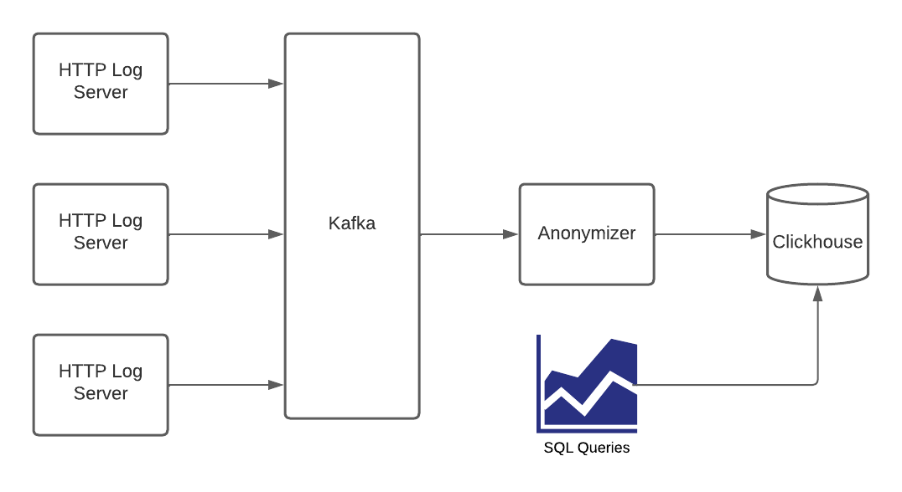

# Data Engineering Task

## Task 1 ETL (Anonymizer)

### Requirements

#### Required
* [Docker](https://docs.docker.com/engine/install/)
* [CapNProto](https://capnproto.org/install.html)

#### Recommended
* [Kafka](https://kafka.apache.org/quickstart)
* [clickhouse-client](https://clickhouse.com/docs/en/getting-started/install/)



Imagine a logging pipeline of HTTP records, data collected from edge
servers and sent to an Apache Kafka topic called `http_log` as messages. Your task consumes
those messages, performs Cap'N Proto decoding, transforms the data as needed, and inserts them
to a ClickHouse table. The Cap'N Proto schema is
[http_log.capnp](http_log.capnp).


Because of the GDPR regulations you have to anonymize the client IP. For
each record change `remoteAddr`'s last octet to X before sending it over to
ClickHouse (e.g. 1.2.3.`4` -> 1.2.3.`X`).

* Each record must be stored to ClickHouse, even in the event of network or server error. Make sure
that you handle those appropriately.
* Your application should communicate with the ClickHouse server only through the proxy which has
rate limiting for a 1 request per minute limit.
* If there are any limitation about your application write down what they are, and how would you solve them in the future.
  For example
  * What is the latency of the data?
  * Is there any scenario when you will start losing data?
  * Is it possible that there will be a stored duplicate record?
* You can implement the task in any of those languages:
  * Go
  * C/C++
  * Java
  * Rust

### SQL / ClickHouse part

Load those data into ClickHouse, using a new table called `http_log` with the following columns.

```
  timestamp DateTime
  resource_id UInt64
  bytes_sent UInt64
  request_time_milli UInt64
  response_status UInt16
  cache_status LowCardinality(String)
  method LowCardinality(String)
  remote_addr String
  url String
```

Provide a table with ready made totals of served traffic for any combination of resource ID, HTTP status,
cache status and IP address. The totals need to be queried efficiently, in seconds at best, for on-demand
rendering of traffic charts in a front-end such as Grafana.

Characterize the aggregated select query time to show the table architecture is fit for purpose.
Provide an estimate of disk space required given
 1) average incoming message rate
 2) retention of the aggregated data

### Testing environment

You can use included [docker-compose.yml](docker-compose.yml) to setup a local
development environment with every service that you will need for this task.

```bash
$ docker-compose up -d
[+] Running 10/10
 ⠿ Network data-engineering-task_default  Created   0.0s
 ⠿ Container zookeeper                    Started   0.9s
 ⠿ Container prometheus                   Started   0.8s
 ⠿ Container clickhouse                   Started   0.9s
 ⠿ Container ch-proxy                     Started   1.2s
 ⠿ Container broker                       Started   1.3s
 ⠿ Container grafana                      Started   1.2s
 ⠿ Container log-producer                 Started   1.7s
 ⠿ Container kafka-ui                     Started   1.9s
 ⠿ Container jmx-kafka                    Started   1.8s
 ```

After running `docker-compose up -d`, Kafka is available on local port 9092.
You can test it with

```bash
$ kafka-console-consumer --bootstrap-server localhost:9092 \
                         --topic http_log \
                         --group data-engineering-task-reader
```

For testing, a service called `http-log-kafka-producer` is provided, started alongside Kafka.
It produces synthetic Cap'n Proto-encoded records. You can adjust its rate of producing via the
`KAFKA_PRODUCER_DELAY_MS` environment variable inside [docker-compose.yml](./docker-compose.yml)

ClickHouse should be accessed through a proxy running on HTTP port 8124.

For convenience, [Kafka-UI](localhost:4000/) and [Grafana](localhost:3000/) are running
(user `admin` and password `kafka`) that might be useful if you run into any trouble
with Kafka.

# Report

## Language

For this project, I decided to choose (and learn) the Go language because of its simplicity and excellent native concurrency support. This concurrency is actively utilized in the code and is crucial for working with big data and distributed systems like Kafka.

## Architecture

The architecture consists of three main components: Consumer, Transformer, and Writer. These components are loosely coupled, which greatly benefits their future maintenance and development. Each component operates in parallel, with communication between them facilitated through Go channels.

The Consumer's purpose is to consume messages from Kafka's `http_log` topic, decode them using the Cap’n Proto schema, and then forward them to the Kafka logs channel (channel between Consumer and Transformer).

The Transformer's primary function is to transform Kafka logs into the appropriate format for database storage. Specifically, the Transformer maps certain Go data types to ClickHouse database types and anonymizes the IP address fields. Afterward, it sends the transformed log to the database http logs channel (channel between Transformer and Writer).

The Writer component is responsible for writing HTTP logs from the channel into the specified database. It is a pretty generic component that is compatible with any database supporting Go's database/sql API. For this particular application, the column-based SQL database ClickHouse is used. During initialization, the Writer opens a connection to the database and creates all necessary tables and views. Writer has a Write method, which is executed in a goroutine to insert logs into the database. A critical consideration here was the limitation on sending requests to the database, such as once per minute. To address this, I implemented a RAM buffer to store all logs before sending them to the database at specified intervals. It was essential to decouple the buffer-filling logic from the actual database insertion process since the latter, being network-dependent, can be slow and should not block buffer filling. More on this I describe later.

## Latency

Considering that, with a large amount of data, the average is a good estimate of the mean value, the following SQL query was used to calculate the average size of a single HTTP log record (with the table containing thousands of rows):

```sql
SELECT 
  table,
  sum(rows) AS rows,
  sum(bytes) AS bytes_size
  FROM system.parts
  WHERE active AND (database = currentDatabase())
GROUP BY table;
```

This revealed that the uncompressed size of one log record is approximately $130$ bytes. It's also straightforward to calculate the aggregated log record size, which is around $40$ bytes. Therefore, the total size of occupied disk space is approximately $170*n$ bytes. However, the actual number is lower because ClickHouse excels at compressing data due to its columnar nature. The compression rate for these data was found to be around $1.23$.

## Fault Tolerance

The system also supports scenarios involving ClickHouse/Kafka server erorrs or network errors. The Writer component handles these in a separate thread (goroutine), allowing the buffer filling process to continue uninterrupted. It periodically attempts to batch insert logs into ClickHouse using a retry mechanism with exponential backoff. However, if the ClickHouse server is down for an extended period, data loss may occur as the RAM buffer reaches its capacity, and the application enters a stale state, awaiting an opportunity to free up the buffer by writing logs into the database. The extent of data loss also depends on Kafka's message storage capacity. If it's sufficiently large, the system can eventually write all the accumulated data once the ClickHouse server is back online. Therefore, in production, it's essential to have an accurate estimate of the real volume of logs that should be processed. In the case of significantly high volumes, I would increase the number of Kafka consumers (in the consumer group) running in parallel and also the number of writer threads that concurrently write data into the ClickHouse database.

## Issues

The primary issue was with the HTTP nginx proxy. The `clickhouse-go` library has poor support for HTTP communication with the ClickHouse server. Not only is this approach significantly slower than using the native TCP protocol, but the HTTP implementation in this library is also problematic. Specifically, for every request — be it table creation or batch insertion — the library sends at least two immediate requests. The first is a connection check, and the second executes the actual action. This behavior of the library is completely incompatible with a 1 request/minute proxy restriction.

One potential solution could be to manually implement the protocol for communication with ClickHouse server via HTTP. However, this task is both time-consuming and, even if successful, likely to be less efficient due to the binary nature of the native TCP protocol. An alternative, yet also challenging, solution would be to find a way to proxy requests at the L4 TCP level rather than the L7 HTTP level. As a result, the current implementation only supports request restriction as an application logic feature, which can be configured via an environment variable.

## Docker

The application has been dockerized and integrated into a Docker Compose setup. To monitor the logs of my module, you can use `docker-compose logs -f http-log-processor`.

## Improvements

- *HTTP Proxy*: Considering the complex issue I mentioned earlier, it's important to thoroughly consider potential solutions or alternatives to it.
- *Error Handling*: It would be beneficial to create custom errors to more precisely identify the types of errors that occur and respond appropriately. For instance, having specific errors like `DecodingError` or `ConsumeMessageError` could provide clearer insights.
- *Tests*: Before moving the application to production, thorough testing is essential.
  - *Unit Tests*: These could cover functionalities such as the anonymize IP function, ensuring they work as intended.
  - *Integration Tests*: To verify the app's integration with services like Kafka and ClickHouse is both correct and reliable.
  - *Performance Tests*: Conducting benchmarks to measure accurate timings, identify bottlenecks, and evaluate request latency and fault tolerance.
- *Security*: The current setup doesn't employ encrypted protocols for network communication. However, for production, using a TLS layer is crucial for ensuring data security.
- *Concurrency*: If consuming Kafka messages becomes a bottleneck, the topic could be split into partitions. This would allow for the creation of a goroutine for each partition, acting as a consumer in the consumer group and enabling parallel message consumption.

## Summary

I believe my solution is efficient, with threads (goroutines) being actively utilized to prevent operations like consuming Kafka messages or writing to the database from blocking other tasks. Additionally, my approach is modular, and the main components are loosely coupled, making it maintainable and easily extendable. Introducing new features, such as additional log transformation logic or different database providers, could be done with minimal adjustments. There are still areas for improvement, as I outlined above, to prepare this application for production deployment. Overall, this project provided me with a truly interesting and valuable programming experience.
